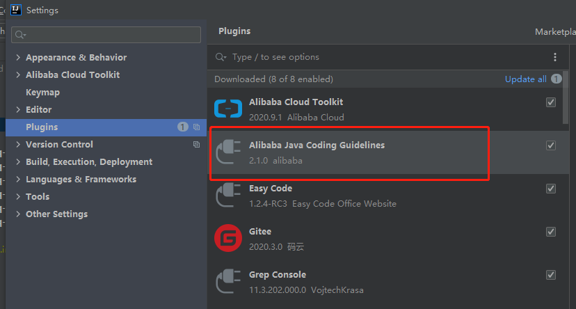
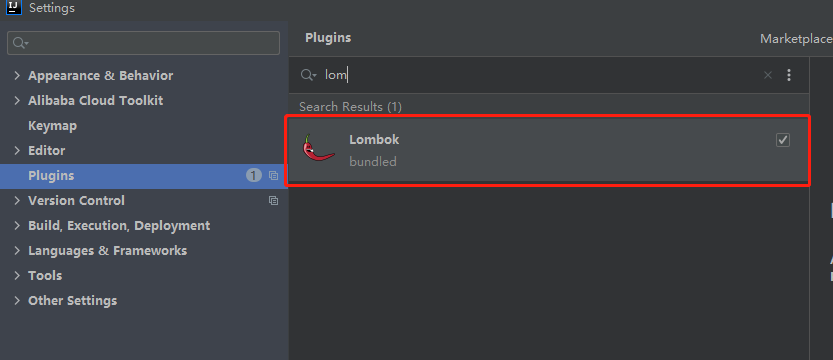
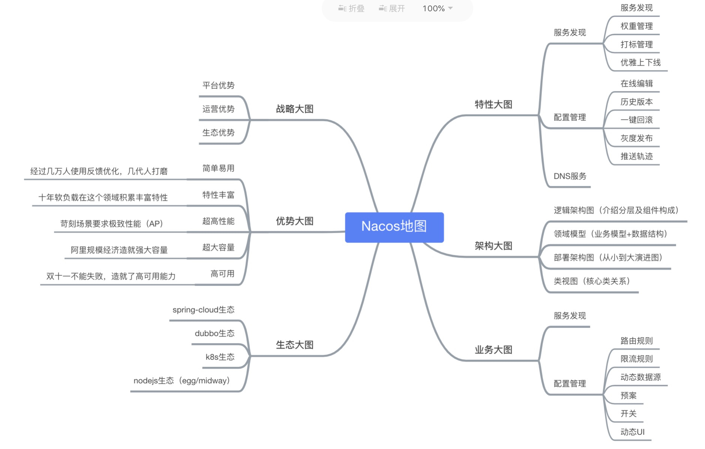
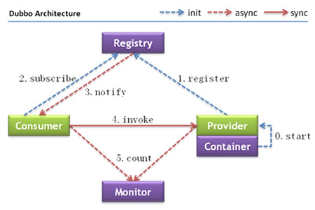
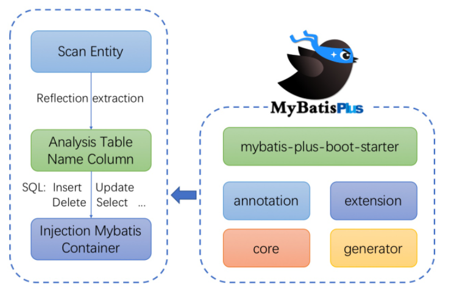

## 开发环境IDEA

​		IntelliJ IDEA（简称 IDEA），是 Java 语言开发的集成环境，IDEA 在业界被公认为最好的 Java 开发工具之一，尤其在智能代码助手、代码自动提示、重构、J2EE 支持、各类版本工具（Git、SVN、GitHub 等）、JUnit、CVS 整合、代码分析和创新的 GUI 设计等方面的功能都值得称道。

​		学习IDEA，请参考学习《[史上最简单的 IntelliJ IDEA 教程](https://guobinhit.github.io/intellij-idea-tutorial/)》

### [IDEA 之 Debug 篇](https://github.com/guobinhit/intellij-idea-tutorial/blob/master/articles/basic-course/debug-skills.md)

### [IDEA 中的版本控制机制](https://github.com/guobinhit/intellij-idea-tutorial/blob/master/articles/basic-course/version-control.md)

### [IDEA 远程调试的方法](https://github.com/guobinhit/intellij-idea-tutorial/blob/master/articles/practical-skills/the-method-of-remote-debugging-with-idea.md)

### 代码规范检查

-  @Data

  注解在类上，会为.的所有属性自动生成setter/getter、equals、canEqual、hashCode、toString方法，如为inal属性，则不会为.属性生成setter方法。

   public NonNullExample(@NonNull Person person) ｛｝

-  @Getter/@Setter

  如果觉得@Data太过残暴（因为@Data集合了@ToString、@EqualsAndHashCode、@Getter/@Setter、@RequiredArgsConstructor的所有特性）不够精细，可以使用@Getter/@Setter注解，此注解在属性上，可以为相应的属性自动生成Getter/Setter方法

- @NonNull

  该注解用在属性或构造器上，Lombok会生成一个非空的声明，可用于校验参数，能帮助避免空指针。

  public NonNullExample(@NonNull Person person) {}

- @Cleanup

  该注解能帮助我们自动调用close()方法，很大的简化了代码。

  @Cleanup InputStream in = new FileInputStream(args[0]);

  @Cleanup OutputStream out = new FileOutputStream(args[1]);

- @EqualsAndHashCode

  默认情况下，会使用所有非静态（non-static）和非瞬态（non-transient）属性来生成equals和hasCode，也能通过exclude注解来排除一些属性。

  @EqualsAndHashCode(exclude={"id", "shape"})

  public class EqualsAndHashCodeExample {

  private Shape shape = new Square(5, 10);

  private String[] tags;

- @Cleanup

  该注解能帮助我们自动调用close()方法，很大的简化了代码

- @ToString

  类使用@ToString注解，Lombok会生成一个toString()方法，默认情况下，会输出类名、所有属性（会按照属性定义顺序），用逗号来分割。

  通过将includeFieldNames参数设为true，就能明确的输出toString()属性。这一点是不是有点绕口，通过代码来看会更清晰些。

  @ToString(exclude="id")

  public class ToStringExample {

   private int id;

  }

- @NoArgsConstructor, @RequiredArgsConstructor and @AllArgsConstructor

  无参构造器、部分参数构造器、全参构造器。Lombok没法实现多种参数构造器的重载

## Nacos

一个更易于构建云原生应用的动态服务发现、配置管理和服务管理平台。

Nacos 致力于帮助您发现、配置和管理微服务。Nacos 提供了一组简单易用的特性集，帮助您快速实现动态服务发现、服务配置、服务元数据及流量管理。

Nacos 帮助您更敏捷和容易地构建、交付和管理微服务平台。 Nacos 是构建以“服务”为中心的现代应用架构 (例如微服务范式、云原生范式) 的服务基础设施

- 解压缩Nacos.zip ，在bin下执行命令：cmd startup.cmd -m standalone
- 关闭服务：cmd shutdown.cmd
- 依照https://nacos.io/zh-cn/docs/quick-start.html网址学习nacos基本用法

## Dubbo

​		Apache Dubbo 是一款高性能、轻量级的开源 Java 服务框架。提供了六大核心能力：面向接口代理的高性能RPC调用，智能容错和负载均衡，服务自动注册和发现，高度可扩展能力，运行期流量调度，可视化的服务治理与运维

### 节点角色说明

| 节点      | 角色说明                               |
| --------- | -------------------------------------- |
| Provider  | 暴露服务的服务提供方                   |
| Consumer  | 调用远程服务的服务消费方               |
| Registry  | 服务注册与发现的注册中心               |
| Monitor   | 统计服务的调用次数和调用时间的监控中心 |
| Container | 服务运行容器                           |

### 调用关系说明

1. 服务容器负责启动，加载，运行服务提供者

2. 服务提供者在启动时，向注册中心注册自己提供的服务

3. 服务消费者在启动时，向注册中心订阅自己所需的服务

4. 注册中心返回服务提供者地址列表给消费者，如果有变更，注册中心将基于长连接推送变更数据给消费者

5. 服务消费者，从提供者地址列表中，基于软负载均衡算法，选一台提供者进行调用，如果调用失败，再选另一台调用

6. 服务消费者和提供者，在内存中累计调用次数和调用时间，定时每分钟发送一次统计数据到监控中心

   [Dubbo2.7文档](https://dubbo.apache.org/zh/docs/v2.7/)

## Mybatis-plus

[MyBatis-Plus (opens new window)](https://github.com/baomidou/mybatis-plus)（简称 MP）是一个 [MyBatis (opens new window)](http://www.mybatis.org/mybatis-3/)的增强工具，在 MyBatis 的基础上只做增强不做改变，为简化开发、提高效率而生

Mybatis-plus官方参考资料及快速入门：https://baomidou.com/guide/

## Spring常用注解

